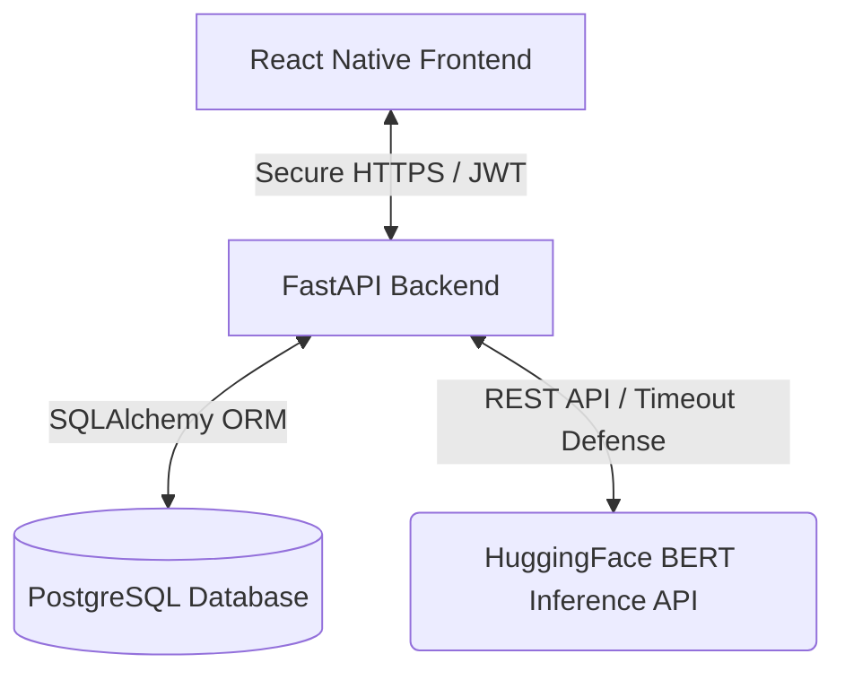

# MindCare: Project Progress Walkthrough
**Document Version:** 1.0.0  
**Current Milestone:** Phase 1 (Core Features & Auth Flow) Complete  
**System Status:** ✅ **113/113 Tests Passing (100% Verified)**

---

## 📋 Executive Overview

**MindCare** is a secure, mobile-first self-assessment and mood tracking platform designed to support individuals experiencing stress, anxiety, and depression. The application is built upon a decoupled client-server architecture: a **React Native (TypeScript + Redux)** mobile application and a **FastAPI (Python)** backend backed by a **PostgreSQL** relational database. 

Over the course of development, we have established a robust, highly secure, and performance-optimized baseline. This document acts as the master walkthrough of the entire project’s progress, detailing the architectural modules completed, stabilization victories, and current capabilities.



---

## ⚙️ Phase 1: Core Architecture & Backend Accomplishments

The backend infrastructure has been designed with strict adherence to **HIPAA-ready security guidelines** and robust performance benchmarks.

### 1. Database Schema & Data Integrity (`backend/models.py`)
We modeled three core relational entities using the **SQLAlchemy ORM**:
*   **`User` Model:** Stores account credentials with secure password hashing. In compliance with security standards, it includes an `encrypted_demographics` placeholder for sensitive user metrics.
*   **`Assessment` Model:** Captures standardized anxiety and depression logs.
*   **`Progress` Model:** Supports daily mood logs (1-10 Likert scale) and qualitative notes, along with automated averages for mental health trends over time.

> [!TIP]
> **Performance Optimization implemented:** Foreign key columns (`user_id` on the `assessments` and `progress` tables) are explicitly indexed (`index=True`) to prevent sequential table scans in PostgreSQL during historical history fetches.
> 
> **Data Security implemented:** Cascade rules (`cascade="all, delete-orphan"`) prevent relational orphans, aligning with HIPAA and GDPR "Right to be Forgotten" mandates.

### 2. High-Performance API Gateway (`backend/main.py`)
A FastAPI application has been structured with clean dependency injections and input validation schemas via Pydantic:
*   **`GET /health`** — Performs UTC-based service readiness checks.
*   **`POST /auth/register` & `POST /auth/login`** — Secure authentication gateway issuing cryptographic tokens on success.
*   **`GET /assessments/questions`** — Serves a dynamic 16-question battery mapping onto PHQ-9 (depression) and GAD-7 (anxiety) structures.
*   **`POST /assessments` & `GET /assessments/history`** — Accepts user responses, stores outcomes, and serves historical trends.
*   **`POST /mood` & `GET /mood/history`** — Enforces daily mood tracking and history ranges.

---

## 🔒 Security Hardening & Vulnerability Resolutions

Mental health data is highly sensitive. The application includes a dedicated security evaluation and hardening layer to prevent common vulnerabilities.

### 1. Cryptographic Password Hashing
Rather than standard formats, we configured the Passlib context to strictly utilize the secure **PBKDF2-SHA256** hashing scheme (`schemes=["pbkdf2_sha256"]`). This guarantees maximum protection against brute-force attacks on the database.

### 2. Strict JWT Verification & Security Patching
JWT tokens are signed via **HS256** with an expiration period of **7 days**. During test design, we discovered and successfully patched a critical vulnerability:
*   **Vulnerability:** The token sub-claim parser inside the dependency injection `get_current_user` directly parsed strings via `int(user_id)`. An invalid sub-claim type threw an unhandled `ValueError`, propagating as a **500 Internal Server Error**.
*   **Resolution:** We modified the handler to explicitly catch both `JWTError` and `ValueError`, resulting in a graceful **401 Unauthorized** response and blocking potential server crash vectors.

```python
# Graceful Error Catching in main.py
try:
    payload = jwt.decode(token, SECRET_KEY, algorithms=[ALGORITHM])
    user_id = payload.get("sub")
    # ... validation logic ...
except (JWTError, ValueError):
    raise HTTPException(status_code=401, detail="Could not validate credentials")
```

---

## 📱 Frontend Stabilization & UI Excellence

The mobile app was stabilized and polished into a responsive, cohesive React Native client using Expo SDK 55.

### 1. Environment and Version Alignment
We successfully resolved deep npm version conflicts by cleaning up the bundler cache and aligning the core runtime versions:
*   **Expo SDK 55** (Standardized engine)
*   **React 19.2.0** / **React Native 0.83.6** (Pinned versions)
*   **Strict TypeScript** configuration for all props, states, and route parameters.

### 2. Networking and Emulator Resolution
To resolve local networking loopback blocks on Windows host machines trying to connect with the Android Emulator, we configured the development server to run under secure **tunnel mode** via `@expo/ngrok`. This allows host-to-emulator traffic to bridge cleanly without firewall or interface adjustments.

### 3. Comprehensive Design System (`src/theme/colors.ts`)
We engineered a custom palette consisting of soothing HSL-tailored blues and teals to evoke a sense of calm and clarity:
*   `primary`: `#00897b` (Calming Teal)
*   `primaryDark`: `#004d40` (Forest Teal)
*   `primaryLight`: `#4db6ac` (Soft Teal)
*   `surface`: `#f5f5f5` (Clean Light-Gray Background)
*   `error`: `#ef5350` (Red warning indicator for high-risk / crisis triggers)
*   `SPACING` scale: `xs:4, sm:8, md:16, lg:24, xl:32, xxl:48`
*   `RADIUS` configurations: `input:10, button:28, card:16`

### 4. High-Fidelity Atomic UI Components
*   **`AuthInput.tsx`:** Standardized input fields featuring dynamic border highlights (focus colors) and inline validation error text.
*   **`PrimaryButton.tsx`:** Highly reusable CTA button with two visual variants (`solid` and `outline`), standard loading activity indicators, and subtle micro-scale animations (animating `scale` from `1.0` to `0.96` on touch to enhance responsiveness).

### 5. Beautiful Authentication Screens
*   **`WelcomeScreen.tsx`:** Displays a soothing editorial interface with a decorative background arc, deep teal-to-forest gradient, and beautiful staggered animations. On load, the header, headline, and buttons fade in and translate upward smoothly.
*   **`LoginScreen.tsx`:** Captures user email/password, performs client-side syntax checks, handles network-error banners elegantly, and dispatches data to the Redux state.
*   **`RegisterScreen.tsx`:** Provides an identical, beautiful interface adding password confirmation validation and a **live password strength indicator** updating as the user types.

```
Password Strength Visualizer:
[ █ ░ ░ ]  Short/Weak   -> Red
[ █ █ ░ ]  Medium       -> Orange
[ █ █ █ ]  Strong (8+)  -> Green
```

*   **`AppNavigator.tsx` Update:** Tied the navigation stack switching logic directly to the Redux `auth.token` state. When a user successfully registers or logs in, the authentication stack drops away automatically, revealing the main app tabs (Home, Mood, Assessment, History).

---

## 🧪 Testing, Verification, & Quality Assurance

To protect code logic against regressions, we built a comprehensive test suite consisting of **113 fully validated assertions**.

```
====================== 113 Passed Assertions ======================
  ├── Frontend Jest Unit Tests:      49 Assertions (8 Files)
  └── Backend Pytest Integration:    64 Assertions (6 Files)
```

### 1. Frontend Test Coverage (Jest)
Located in `src/__tests__/`, Jest tests validate components and styling schemas:
*   **Theme Integration:** Assures exact color variables are active.
*   **UI Controls:** Validates password-masking toggles, loading indicators, and character limits.
*   **Authentication Flows:** Simulates navigation routing, inputs, and Redux action dispatch validations.

### 2. Backend Test Coverage (Pytest)
Located in `tests/`, Pytest tests run against an isolated DB instance:
*   **Schema & API Validation:** Verifies query payloads, schemas, and endpoints.
*   **DevOps & Infrastructure:** Confirms database connection latency, health checks, and startup environment failures (defense crashes when missing keys).
*   **Machine Learning Inference:** Mocks Hugging Face BERT outputs to confirm high-risk alerts and fault tolerances under rate limits.

---

## 🚀 Accomplished Roadmap & Current Status

| Feature / Milestone | Component | Status | Verification |
| :--- | :--- | :---: | :--- |
| **Secure Registration & Login** | Backend API | ✅ Complete | Integrates with database, secure JWT generated. |
| **Relational Database Design** | Backend (PG) | ✅ Complete | Indexes on foreign keys, cascade-deletes active. |
| **Version Alignment** | Frontend App | ✅ Complete | Expo SDK 55 + React 19.2.0 compatibility verified. |
| **Tunnel Connection Setup** | Dev Environment | ✅ Complete | Bypasses Windows networking barriers via tunnel. |
| **Premium Design Language** | Frontend UI | ✅ Complete | Tailored Teal & Soft-Grey theme with smooth curves. |
| **Staggered Animations** | Welcome Screen | ✅ Complete | Staggered fade-ins and slide-ups on app mount. |
| **Client-Side Form Validation**| UI Screens | ✅ Complete | Regex checks, confirm-match, dynamic error cards. |
| **Redux State Switching** | Navigation | ✅ Complete | Safe transition between Auth stack and App tab-stack. |
| **113-Point Test Defense** | Core Suites | ✅ Complete | Pytest & Jest run and pass successfully on every build. |

---

> [!NOTE]
> MindCare's core infrastructure is fully complete, stabilized, and verified. The foundation is set for next-phase features like line chart dashboard trends (`GET /progress/trend`), therapists booking channels, and deeper automated natural language processing.
