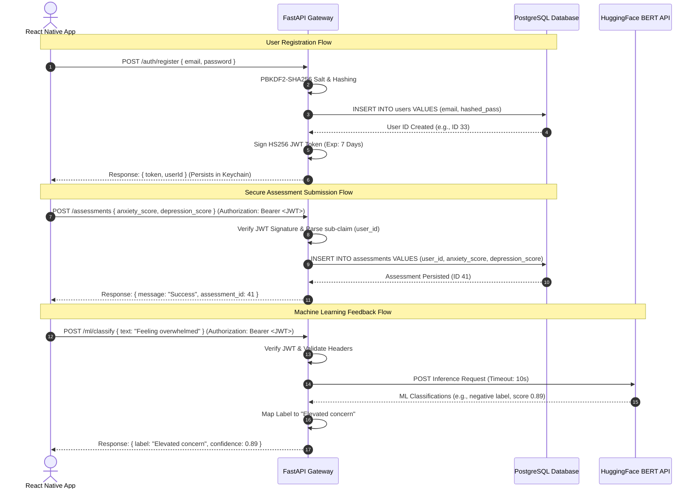

# MindCare: System Architecture & API Reference
**Document Version:** 1.0.0  
**Target Audience:** Systems Architects, Core Developers, Compliance Auditors  

This document serves as the high-level system architecture and API reference manual for the MindCare platform. It details the structural relationships between frontend and backend layers, outlines the PostgreSQL relational database schema, and catalogs every available API endpoint.

---

## 🎨 1. Interactive System Architecture Flow

MindCare is a decoupled system using a client-server structure. Below is a visual representation of how user actions trigger database queries, scoring loops, and machine learning inferences across the API boundary.

### End-to-End User Session Sequence


---

## 🗄️ 2. PostgreSQL Relational Database Schema

The database consists of three primary tables linked by relational constraints and optimized with indexing structures.

### A. Entity-Relationship Summary
*   A **`User`** has zero or more **`Assessment`** entries (one-to-many relationship).
*   A **`User`** has zero or more **`Progress`** entries (one-to-many relationship).
*   Deleting a **`User`** automatically deletes all corresponding **`Assessment`** and **`Progress`** records via database-level cascades.

```
┌──────────────┐          ┌─────────────────┐
│    users     │ 1 ─── 0* │   assessments   │
│  (Profile)   │          │ (PHQ-9 / GAD-7) │
└──────┬───────┘          └─────────────────┘
       │
       └─ 1 ─── 0* ┌─────────────────┐
                   │    progress     │
                   │ (Mood Tracking) │
                   └─────────────────┘
```

---

### B. Table Schema Specifications

#### 1. `users` Table
Stores authentication credentials and HIPAA-ready demographics placeholder.
*   **Primary Key:** `id` (Integer, Auto-increment)
*   **Indexes:** `email` (Unique, Index), `id` (Index)

| Column | Type | Constraints | Description |
| :--- | :--- | :--- | :--- |
| `id` | `INTEGER` | `PRIMARY KEY`, `AUTO_INCREMENT` | Unique identifier. |
| `email` | `VARCHAR` | `UNIQUE`, `NOT NULL`, `INDEX` | User's account email address. |
| `hashed_password` | `VARCHAR` | `NOT NULL` | Cryptographically hashed password (PBKDF2). |
| `encrypted_demographics` | `VARCHAR` | `NULLABLE` | Placeholder for secure demographics data. |
| `created_at` | `TIMESTAMP` | `DEFAULT UTC_NOW` | Timestamp of registration. |

#### 2. `assessments` Table
Stores standardized clinical scoring levels calculated on the backend.
*   **Primary Key:** `id` (Integer, Auto-increment)
*   **Foreign Key:** `user_id` (References `users.id` with `cascade="all, delete-orphan"`)
*   **Indexes:** `user_id` (Index), `id` (Index)

| Column | Type | Constraints | Description |
| :--- | :--- | :--- | :--- |
| `id` | `INTEGER` | `PRIMARY KEY`, `AUTO_INCREMENT` | Unique identifier. |
| `user_id` | `INTEGER` | `FOREIGN KEY`, `NOT NULL`, `INDEX` | Owner user ID (indexed for performance). |
| `anxiety_score` | `FLOAT` | `NOT NULL` | Aggregated GAD-7 score (0-21 scale). |
| `depression_score` | `FLOAT` | `NOT NULL` | Aggregated PHQ-9 score (0-27 scale). |
| `taken_at` | `TIMESTAMP` | `DEFAULT UTC_NOW` | Date/time assessment was recorded. |

#### 3. `progress` Table
Stores daily qualitative and quantitative mood tracking logs.
*   **Primary Key:** `id` (Integer, Auto-increment)
*   **Foreign Key:** `user_id` (References `users.id` with `cascade="all, delete-orphan"`)
*   **Indexes:** `user_id` (Index), `id` (Index)

| Column | Type | Constraints | Description |
| :--- | :--- | :--- | :--- |
| `id` | `INTEGER` | `PRIMARY KEY`, `AUTO_INCREMENT` | Unique identifier. |
| `user_id` | `INTEGER` | `FOREIGN KEY`, `NOT NULL`, `INDEX` | Owner user ID (indexed for performance). |
| `mood_score` | `INTEGER` | `NOT NULL` | Numeric mood rating (1-10 Likert scale). |
| `note` | `VARCHAR` | `NULLABLE` | Optional descriptive user check-in log. |
| `avg_anxiety` | `FLOAT` | `NULLABLE` | Computed average anxiety score for the period. |
| `avg_depression`| `FLOAT` | `NULLABLE` | Computed average depression score for the period. |
| `avg_stress` | `FLOAT` | `NULLABLE` | Computed average stress score for the period. |
| `recorded_at` | `TIMESTAMP` | `DEFAULT UTC_NOW` | Date/time progress log was recorded. |

---

## 🌐 3. REST API Endpoint Directory

Every endpoint requires structured payloads and enforces status codes in alignment with RFC HTTP guidelines.

### Summary Matrix
| Method | Path | Authentication | Expected Status | Description |
| :---: | :--- | :---: | :---: | :--- |
| **`GET`** | `/health` | None (Public) | `200 OK` | Service readiness test. |
| **`POST`**| `/auth/register` | None (Public) | `200 OK` | Register account, issue JWT. |
| **`POST`**| `/auth/login` | None (Public) | `200 OK` | Authenticate account, issue JWT. |
| **`GET`** | `/assessments/questions`| Bearer JWT | `200 OK` | Fetch clinical questions. |
| **`POST`**| `/assessments` | Bearer JWT | `200 OK` | Submit scores. |
| **`GET`** | `/assessments/history` | Bearer JWT | `200 OK` | Fetch assessment records. |
| **`POST`**| `/ml/classify` | Bearer JWT | `200 OK` / `503` | HF text classification. |
| **`POST`**| `/mood` | Bearer JWT | `200 OK` / `422` | Record daily mood log. |
| **`GET`** | `/mood/history` | Bearer JWT | `200 OK` / `400` | Fetch mood logs list. |

---

### Endpoint Specifications

#### 1. Service Health check
*   **Method:** `GET`
*   **Path:** `/health`
*   **Response Payload (200 OK):**
    ```json
    {
      "status": "ok",
      "timestamp": "2026-05-24T15:22:10.782535"
    }
    ```

#### 2. User Registration
*   **Method:** `POST`
*   **Path:** `/auth/register`
*   **Request Schema (`AuthSchema`):**
    ```json
    {
      "email": "user@example.com",
      "password": "securepassword123"
    }
    ```
*   **Response Payload (200 OK):**
    ```json
    {
      "token": "eyJhbGciOiJIUzI1NiIsInR5cCI6IkpXVCJ9...",
      "userId": 33
    }
    ```
*   **Errors Supported:**
    *   `400 Bad Request` — `{"detail": "Email already registered"}`

#### 3. User Login
*   **Method:** `POST`
*   **Path:** `/auth/login`
*   **Request Schema (`AuthSchema`):**
    ```json
    {
      "email": "user@example.com",
      "password": "securepassword123"
    }
    ```
*   **Response Payload (200 OK):**
    ```json
    {
      "token": "eyJhbGciOiJIUzI1NiIsInR5cCI6IkpXVCJ9...",
      "userId": 33
    }
    ```
*   **Errors Supported:**
    *   `401 Unauthorized` — `{"detail": "Invalid credentials"}`

#### 4. Fetch Assessment Questions
*   **Method:** `GET`
*   **Path:** `/assessments/questions`
*   **Headers Required:** `Authorization: Bearer <JWT>`
*   **Response Payload (200 OK):**
    ```json
    [
      {
        "id": "phq1",
        "text": "Over the last 2 weeks, how often have you been bothered by little interest or pleasure in doing things?",
        "category": "depression",
        "options": [
          {"label": "Not at all", "value": 0},
          {"label": "Several days", "value": 1},
          {"label": "More than half the days", "value": 2},
          {"label": "Nearly every day", "value": 3}
        ]
      }
    ]
    ```

#### 5. Submit Assessment Scores
*   **Method:** `POST`
*   **Path:** `/assessments`
*   **Headers Required:** `Authorization: Bearer <JWT>`
*   **Request Schema (`AssessmentSubmitSchema`):**
    ```json
    {
      "anxiety_score": 12.0,
      "depression_score": 15.0
    }
    ```
*   **Response Payload (200 OK):**
    ```json
    {
      "message": "Assessment submitted successfully",
      "assessment_id": 41
    }
    ```

#### 6. Fetch Assessment History
*   **Method:** `GET`
*   **Path:** `/assessments/history?days=30`
*   **Headers Required:** `Authorization: Bearer <JWT>`
*   **Query Parameters:** `days` (Integer, default `30`, filters historical entries range)
*   **Response Payload (200 OK):**
    ```json
    {
      "items": [
        {
          "id": 41,
          "depression_score": 15.0,
          "anxiety_score": 12.0,
          "created_at": "2026-05-24T15:20:00Z"
        }
      ]
    }
    ```

#### 7. Machine Learning Feedback Classifier
Sends a qualitative string to an integrated **HuggingFace BERT model (`mental-bert-base-uncased`)** to classify mental health risk levels.
*   **Method:** `POST`
*   **Path:** `/ml/classify`
*   **Headers Required:** `Authorization: Bearer <JWT>`
*   **Request Schema (`MLClassifyRequest`):**
    ```json
    {
      "text": "Lately I have been feeling incredibly overwhelmed and anxious about my deadlines."
    }
    ```
*   **Response Payload (200 OK):**
    ```json
    {
      "label": "Elevated concern",
      "confidence": 0.89,
      "error": null
    }
    ```
*   **Fault-Tolerance Defense:**
    If the HuggingFace API is unreachable or rate-limited, the endpoint catches the timeout/network errors gracefully and responds with a **`503 Service Unavailable`** code alongside a fallback label to prevent application crashes:
    ```json
    {
      "label": "Unavailable",
      "confidence": 0.0,
      "error": "ML service temporarily unavailable"
    }
    ```

#### 8. Record Daily Mood Check-In
*   **Method:** `POST`
*   **Path:** `/mood`
*   **Headers Required:** `Authorization: Bearer <JWT>`
*   **Request Schema (`MoodCreate`):**
    ```json
    {
      "mood_score": 8,
      "note": "Feeling positive and had a good rest today."
    }
    ```
*   **Response Payload (200 OK):**
    ```json
    {
      "id": 56,
      "mood_score": 8,
      "note": "Feeling positive and had a good rest today.",
      "recorded_at": "2026-05-24T20:45:00Z"
    }
    ```
*   **Errors Supported:**
    *   `422 Unprocessable Entity` — If `mood_score` is outside the required `1-10` scale range.

#### 9. Fetch Mood History List
*   **Method:** `GET`
*   **Path:** `/mood/history?days=30`
*   **Headers Required:** `Authorization: Bearer <JWT>`
*   **Query Parameters:** `days` (Integer, default `30`)
*   **Response Payload (200 OK):**
    ```json
    [
      {
        "id": 56,
        "mood_score": 8,
        "note": "Feeling positive and had a good rest today.",
        "recorded_at": "2026-05-24T20:45:00Z"
      }
    ]
    ```
*   **Errors Supported:**
    *   `400 Bad Request` — If `days` parameter is less than or equal to `0`.
